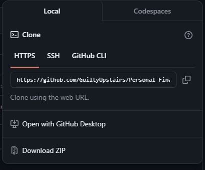

# Personal-Finance-Tracker (For Reference)

<!-- Steps to contribute to Repo (For my Reference) -->

  ## 1. Cloning a Repository

  ```sh
    git clone "https://github.com/GuiltyUpstairs/Personal-Finance-Tracker.git"
    cd Personal-Finance-Tracker
  ```

  First we clone the repo.
  We could also do this,

  

  ## 2. Making Changes and Running

  IN order to run the cloned repo we could run the following shell commands:

  ```sh
    cd Personal-Finance-Tracker
    npm install
    npm run dev
  ```

  Then, we can stage the changes and commit.


cd frontend
npm start

# Other environment variables as needed
